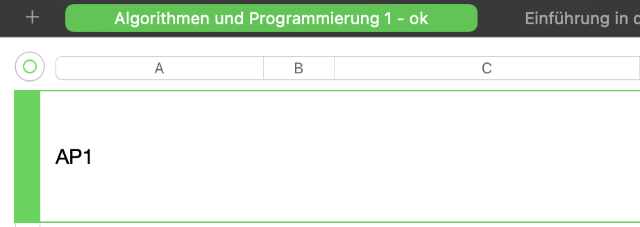

# Medieninformatik 5.0

Nutzt [11ty](https://www.11ty.dev) für die strukturierte Ablage von Content.

## Status von Dokumenten

| Kürzel | Bedeutung | Was ist zu tun? |
| ---- | ---- | ---- |
| tbd | to be done | loslegen! |
| wip | in Arbeit | nix |
| rfreview | Wartet auf Review | Review machen |
| review | im Review | nix |
| refactor | Überarbeitung erforderlich | bitte überarbeiten |
| ok | Fertig | nix |

## Deployment

Seit dem 07.12.2023 wird der `public` Branch deployt, da wir jetzt die URL an externe weiter gegeben haben und der Stand stabil sein muss. Wenn ihr Änderungen habt, benutzt bitte am Besten einen Pull Request.

## Ordnerstruktur

### `/docs`
kompilierter Code … do not touch 👻


### `/src` hier wird entwickelt

```
_layouts                           Templates
assets                             SCSS, Skripts, Fonts, etc … alles was kein Content ist
compiled-assets                    Kompilierte Dateien, z.B. CSS
modulbeschreibungen-bachelor-bpo5  Modulbeschreibungen Bachelor
modulbeschreibungen-master-mpo5    Modulbeschreibungen Master
kurzbericht                        Snippets Kurzbericht
```

### Weitere Dateien
```
.eleventy.js        Config von 11ty
.eleventyignore     Welche Folder/ Files soll 11ty ignorieren?
.eslintrc.json      
.gitignore          
.stylelintrc.json   
```

## Funktionen

- `npm install`
- `npm run build` 
- `npm run dev` 
- `npm run quiet` 
- `npm run convert:comp`

## Review Guidelines
- Modulkürzel passen?

### Module
- Präsenzzeit & Selbstlernzeit (15 Wochen?)

## Modulkompetenzen importieren
Derzeit werden die konkreten Modulkompetenzen der Modul in zwei Numberslisten gepflegt:
- [Modulkompetenzen Bachelor](https://www.icloud.com/numbers/059tzkqaVJGuVDpQP988kP2OQ#kompetenzen-in-modulen-mi5)
- [Modulkompetenzen Master](https://www.icloud.com/numbers/06ckJFHGVgxsM4eOueYzBY0Bg#kompetenzen-in-modulen-mi5)

Diese werden dann hübsch als `*.csv` Datei exportiert und in folgende Verzeichnisse gelegt:
- `./kompetenzen/csv-exports-from-numbers/kompetenzen-in-modulen-mi5.0-bachelor/`
- `./kompetenzen/csv-exports-from-numbers/kompetenzen-in-modulen-mi5.0-master/`

Von dort können sie dann mit dem Befehl `npm run convert:comp` konvertiert und dem System zugänglich gemacht werden. Die CSV-Daten werden in ein JSON Format überführt und für jedes Modul wird eine eigene Datei angelegt:
- `./src/modulkompetenzen-bachelor`
- `./src/modulkompetenzen-master`

Die Verknüfung erfolgt über das Modulkürzel, welches in der Numbers Datei in der Headline vermerkt sind muss.


